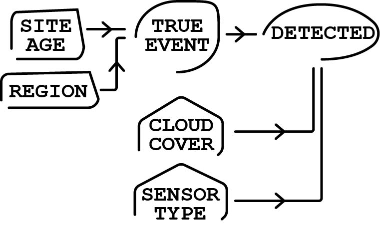

```{r}
library(tidyverse)
library(brms)
library(posterior)

dir.create("outputs", showWarnings = FALSE)
dir.create("outputs/models", recursive = TRUE, showWarnings = FALSE)
dir.create("outputs/tables", recursive = TRUE, showWarnings = FALSE)
dir.create("outputs/summaries", recursive = TRUE, showWarnings = FALSE)
```

***Supplementary Note:** Without a thesis for this paper to contribute to, my goal was to demonstrate a working knowledge of statistical knowledge gained from the EcoStats course, while also improving my ability to present data and build a quarto/github workflow, presenting data is my core interest. As a result, there is no complete existing datset to analyze and the monitoring dataset used here was constructed using open data and the assistance of AI. Additionally, copilot was used to edit Quarto formatting to ensure formatting and functionality when publishing.*

# Background

I have a **repeated-survey** methane monitoring dataset. Each site is visited multiple times within one monitoring window. For each survey, I record whether a methane leak was detected, along with survey conditions such as *cloud cover* and *sensor type*. At the site level, I also have *infrastructure age* and *region*.

The key problem is that a nondetection is ambiguous. [A zero in the observed data can mean that no leak was present, but it can also mean that a leak was present and the monitoring system missed it.]{.underline}

That is the whole statistical tension in this project.

So our data story is not just “did we detect a leak?” It is:

-   **site status process**: Is there actually a leak at this site?

-   **observation process**: If there is a leak, do survey conditions allow us to detect it?

## Monitoring design and data structure

This analysis uses a repeated-survey methane monitoring dataset with 24 sites distributed across 4 regions and 4 surveys per site, for a total of 96 survey observations. The four surveys occur within a single monitoring window, so site status is treated as **fixed** across visits. Site age is used as a [predictor of occurrence]{.underline}, while cloud cover and sensor type are used as [predictors of detection]{.underline}. A benchmark-confirmed site-status variable also allows the site-level occurrence model to be evaluated against known status rather than relying only on observed detection.

## How does this inform our model?

**The outcomes of interest!**

Whether a site was ever detected, whether a leak was present, and whether a leak was detected during a given survey are all binary, so a **Bernoulli** **model with a logit link** is the natural framework, so our response is probability rather than a continuous value. The **detection model** also functions as a multiple regression because it estimates the effects of cloud cover and sensor type at the same time. The **occurrence model** adds a region random intercept, allowing baseline leak probability to vary across regions rather than assuming all sites share the same starting point.

Parameters are represented as distributions of plausible values rather than as single fixed estimates, and uncertainty is summarized with posterior means and credible intervals. More broadly, the paper analysis fits within Bayesian regression, moving beyond a single simple regression and shows how generalized linear models, partial pooling, and basic overfitting control can be used together in an environmental monitoring problem.

# Overview

This document analyzes a repeated-survey methane monitoring dataset with imperfect detection. The benchmark data files are included with the project, so the analysis begins by reading in the static site-level and survey-level data rather than generating them inside the report.

The three fitted models stay within course scope:

-   **naive model**: `ever_detected ~ site_age_z`
-   **occurrence model**: `true_event ~ site_age_z + (1 | region`
-   **conditional detection model**: `detected ~ cloud_cover_z + sensor_advanced`

## DAG



**Site age** and **region** affect the probability that a site truly has a leak. **True site** status then determines whether a **detection** is even possible. Conditional on a leak being present, **cloud cover** and **sensor type** affect the probability that the leak is observed during a survey. My goals was to separate the occurrence process from the observation process without overstating the analysis as a full latent-state model.

# Read Data

```{r}
#| output: false

site_df <- readr::read_csv("data/site_df.csv", show_col_types = FALSE) |>
  mutate(
    site_id = factor(site_id),
    region = factor(region, levels = c("North", "South", "Central", "West"))
  )

survey_df <- readr::read_csv("data/survey_df.csv", show_col_types = FALSE) |>
  mutate(
    site_id = factor(site_id),
    survey_id = factor(survey_id),
    region = factor(region, levels = c("North", "South", "Central", "West")),
    sensor_type = factor(sensor_type, levels = c("basic", "advanced"))
  )

site_naive_df <- readr::read_csv("data/site_naive_df.csv", show_col_types = FALSE) |>
  mutate(
    site_id = factor(site_id),
    region = factor(region, levels = c("North", "South", "Central", "West"))
  )
```

# Data Summary

```{r}
tibble(
  n_sites = nrow(site_df),
  n_survey_rows = nrow(survey_df),
  n_regions = dplyr::n_distinct(site_df$region),
  surveys_per_site = dplyr::n_distinct(survey_df$survey_id),
  true_occurrence_prevalence = mean(site_df$true_event),
  observed_survey_detection_prevalence = mean(survey_df$detected),
  site_ever_detected_prevalence = mean(site_naive_df$ever_detected)
)
```

# Statistical Models

Because the continuous predictors are standardized, `normal(0, 1)` is a sensible weak prior for slopes on the logit scale, while `normal(0, 1.5)` is a weak prior for intercepts. The random-intercept standard deviation gets an `exponential(1)` prior.

```{r}
naive_priors <- c(
  prior(normal(0, 1.5), class = "Intercept"),
  prior(normal(0, 1), class = "b")
)

occurrence_priors <- c(
  prior(normal(0, 1.5), class = "Intercept"),
  prior(normal(0, 1), class = "b"),
  prior(exponential(1), class = "sd")
)

detection_priors <- c(
  prior(normal(0, 1.5), class = "Intercept"),
  prior(normal(0, 1), class = "b")
)
```

```{r}
#| output: false

naive_fit <- readRDS("outputs/models/naive_fit.rds")
occurrence_fit <- readRDS("outputs/models/occurrence_fit.rds")
detection_fit <- readRDS("outputs/models/detection_fit.rds")
```

# Model summaries

## Choosing Our Analysis

We chose these models because they match the structure of the data **without going beyond course scope**.

### 1. Naive model

`ever_detected ~ site_age_z`

This model treats “detected at least once” as if it were the same as “site truly has a leak.” It is intentionally naive. I use it as a comparison model because it shows what happens when imperfect detection is ignored.

### 2. Occurrence model

`true_event ~ site_age_z + (1 | region)`

This is the site-level model. It asks: how does the probability of a leak change with infrastructure age, while allowing regions to have different baselines? I include a region random intercept because sites in the same region are not fully independent, and random intercepts are the standard way to represent group-specific baseline differences.

### 3. Detection model

`detected ~ cloud_cover_z + sensor_advanced`, fit only where `true_event == 1`

This is the survey-level model. It asks how cloud cover and sensor type affect the chance of detecting a leak when a leak is actually present.

So the analysis is split into:

-   a **benchmark occurrence model**

-   a **conditional detection model**

-   plus a **naive model** for contrast

While I could build a more elaborate hierarchical occupancy model that can estimate occupancy and detection jointly, that demands more data and complexity than the scope of what I sat out for the project.

## `summary()` output

```{r}
summary(naive_fit)
summary(occurrence_fit)
summary(detection_fit)
```

## Compact posterior summary table

```{r}
posterior_summary_table <- bind_rows(
  posterior_summary(naive_fit) |>
    as.data.frame() |>
    rownames_to_column("parameter") |>
    as_tibble() |>
    filter(parameter %in% c("b_Intercept", "b_site_age_z")) |>
    mutate(model = "Naive"),

  posterior_summary(occurrence_fit) |>
    as.data.frame() |>
    rownames_to_column("parameter") |>
    as_tibble() |>
    filter(parameter %in% c("b_Intercept", "b_site_age_z", "sd_region__Intercept")) |>
    mutate(model = "Occurrence"),

  posterior_summary(detection_fit) |>
    as.data.frame() |>
    rownames_to_column("parameter") |>
    as_tibble() |>
    filter(parameter %in% c("b_Intercept", "b_cloud_cover_z", "b_sensor_advanced")) |>
    mutate(model = "Detection")
) |>
  select(model, parameter, Estimate, Est.Error, Q2.5, Q97.5)

posterior_summary_table
```

```{r}
write_csv(posterior_summary_table, "outputs/summaries/posterior_summary_table.csv")
```

The posterior summary table provides the main coefficient estimates on the logit scale. The most stable patterns in this analysis are the positive association between site age and occurrence and the negative association between cloud cover and detection. The advanced sensor coefficient is positive in direction, which is consistent with better performance, but its interpretation should follow the uncertainty shown in the interval estimate.

## R-hat and ESS Table

```{r}
diagnostics_table <- bind_rows(
  naive_fit |>
    as_draws_df() |>
    summarise_draws(default_convergence_measures()) |>
    as_tibble() |>
    filter(variable %in% c("b_Intercept", "b_site_age_z")) |>
    mutate(model = "Naive"),

  occurrence_fit |>
    as_draws_df() |>
    summarise_draws(default_convergence_measures()) |>
    as_tibble() |>
    filter(variable %in% c("b_Intercept", "b_site_age_z", "sd_region__Intercept")) |>
    mutate(model = "Occurrence"),

  detection_fit |>
    as_draws_df() |>
    summarise_draws(default_convergence_measures()) |>
    as_tibble() |>
    filter(variable %in% c("b_Intercept", "b_cloud_cover_z", "b_sensor_advanced")) |>
    mutate(model = "Detection")
) |>
  select(model, variable, rhat, ess_bulk, ess_tail)

diagnostics_table
```

```{r}
write_csv(diagnostics_table, "outputs/summaries/diagnostics_table.csv")
```

The convergence diagnostics do not suggest major sampling problems. Values of R\^\hat{R}R\^ near 1 and adequate effective sample sizes indicate that the posterior chains mixed well enough for the current analysis. This does not guarantee a perfect model, but it does support the basic reliability of the posterior summaries.

# Posterior predictive checks

```{r}
#| fig-cap: "Posterior predictive check for the naive model."
pp_check(naive_fit, type = "bars", ndraws = 100)
```

***Figure 1.** Posterior predictive check for the naive model.*

```{r}
#| fig-cap: "Posterior predictive check for the occurrence model."
pp_check(occurrence_fit, type = "bars", ndraws = 100)
```

***Figure 2.** Posterior predictive check for the occurrence model.*

```{r}
#| fig-cap: "Posterior predictive check for the conditional detection model."
pp_check(detection_fit, type = "bars", ndraws = 100)
```

***Figure 3.** Posterior predictive check for the conditional detection model.*

The posterior predictive checks suggest that all three Bernoulli models reproduce the overall proportion of zeros and ones reasonably well. They show that the models are not obviously misfitting the data, but they do not by themselves establish that every predictor relationship has been captured in detail.

# Repeated surveys and imperfect detection

```{r}
#| fig-cap: "Repeated surveys within one monitoring window. Gray tiles indicate benchmark-confirmed absence, gold tiles indicate missed detection, and green tiles indicate successful detection."

figure1_sites <- survey_df |>
  group_by(region, site_id) |>
  summarise(
    true_event = first(true_event),
    n_detected = sum(detected),
    n_surveys = n(),
    .groups = "drop"
  ) |>
  mutate(
    priority = case_when(
      true_event == 1 & n_detected > 0 & n_detected < n_surveys ~ 1L,
      true_event == 1 & n_detected > 0 ~ 2L,
      true_event == 0 ~ 3L,
      TRUE ~ 4L
    )
  ) |>
  arrange(region, priority, desc(n_detected), site_id) |>
  group_by(region) |>
  slice_head(n = 1) |>
  ungroup() |>
  pull(site_id)

history_df <- survey_df |>
  filter(site_id %in% figure1_sites) |>
  mutate(
    outcome_type = case_when(
      true_event == 0 ~ "True absence",
      true_event == 1 & detected == 0 ~ "Missed detection",
      true_event == 1 & detected == 1 ~ "Detected"
    ),
    outcome_type = factor(
      outcome_type,
      levels = c("True absence", "Missed detection", "Detected")
    )
  )

ggplot(history_df, aes(x = survey_id, y = fct_rev(site_id), fill = outcome_type)) +
  geom_tile(color = "white", linewidth = 0.5) +
  facet_wrap(~ region, scales = "free_y") +
  scale_fill_manual(
    values = c(
      "True absence" = "grey85",
      "Missed detection" = "goldenrod2",
      "Detected" = "seagreen3"
    )
  ) +
  labs(x = "Survey occasion", y = "Site", fill = NULL) +
  theme_minimal(base_size = 12) +
  theme(
    legend.position = "bottom",
    panel.grid = element_blank()
  )
```

***Figure 4.** Repeated surveys within one monitoring window. Gray tiles indicate benchmark-confirmed absence, gold tiles indicate missed detection, and green tiles indicate successful detection. The figure shows that even when a leak is present, it is not detected on every survey.*

Some sites with benchmark-confirmed leaks were detected on some visits but missed on others, which means a zero in the observed data does not always imply absence. This is the reason a naive model can underestimate occurrence: it treats nondetection and true absence as if they were the same outcome.

# Predicted detection probability across cloud cover

```{r}
#| fig-cap: "Posterior predicted detection probability across cloud cover for basic and advanced sensors."

cloud_seq <- seq(min(survey_df$cloud_cover), max(survey_df$cloud_cover), length.out = 100)

detection_newdata <- expand_grid(
  cloud_cover = cloud_seq,
  sensor_advanced = c(0, 1)
) |>
  mutate(
    cloud_cover_z = (cloud_cover - mean(survey_df$cloud_cover)) / sd(survey_df$cloud_cover),
    sensor_type = factor(
      if_else(sensor_advanced == 1, "advanced", "basic"),
      levels = c("basic", "advanced")
    )
  )

epred_detection <- posterior_epred(
  detection_fit,
  newdata = detection_newdata,
  re_formula = NA
)

detection_plot_df <- as_tibble(t(epred_detection)) |>
  mutate(row_id = row_number()) |>
  pivot_longer(cols = -row_id, names_to = "draw", values_to = "epred") |>
  group_by(row_id) |>
  summarise(
    mean = mean(epred),
    lower = quantile(epred, 0.025),
    upper = quantile(epred, 0.975),
    .groups = "drop"
  ) |>
  bind_cols(detection_newdata)

ggplot(detection_plot_df, aes(x = cloud_cover, y = mean, color = sensor_type, fill = sensor_type)) +
  geom_ribbon(aes(ymin = lower, ymax = upper), alpha = 0.20, linewidth = 0, color = NA) +
  geom_line(linewidth = 1.1) +
  coord_cartesian(ylim = c(0, 1)) +
  labs(
    x = "Cloud cover (%)",
    y = "Detection probability",
    color = "Sensor type",
    fill = "Sensor type"
  ) +
  theme_minimal(base_size = 12) +
  theme(legend.position = "bottom")
```

***Figure 5.** Posterior predicted detection probability across cloud cover for basic and advanced sensors. Detection declines as cloud cover increases, while the advanced sensor remains associated with higher detection probability across most of the observed range.*

This figure shows the clearest signal in the survey-level analysis. Detection probability declines as cloud cover increases, which is consistent with the expectation that poor viewing conditions reduce successful remote sensing. The advanced sensor also tends to maintain higher predicted detection probability than the basic sensor, suggesting that sensor type matters as well.

# Naive versus detection-aware occurrence across site age

```{r}
#| fig-cap: "Naive versus detection-aware occurrence estimates across site age."

age_seq <- seq(min(site_df$site_age), max(site_df$site_age), length.out = 100)
age_seq_z <- (age_seq - mean(site_df$site_age)) / sd(site_df$site_age)

naive_newdata <- tibble(site_age_z = age_seq_z)

occurrence_newdata <- tibble(
  site_age_z = age_seq_z,
  region = factor("North", levels = levels(site_df$region))
)

epred_naive <- posterior_epred(
  naive_fit,
  newdata = naive_newdata,
  re_formula = NA
)

epred_occurrence <- posterior_epred(
  occurrence_fit,
  newdata = occurrence_newdata,
  re_formula = NA
)

naive_curve_df <- as_tibble(t(epred_naive)) |>
  mutate(row_id = row_number()) |>
  pivot_longer(cols = -row_id, names_to = "draw", values_to = "epred") |>
  group_by(row_id) |>
  summarise(
    mean = mean(epred),
    lower = quantile(epred, 0.025),
    upper = quantile(epred, 0.975),
    .groups = "drop"
  ) |>
  mutate(site_age = age_seq, model = "Naive")

occurrence_curve_df <- as_tibble(t(epred_occurrence)) |>
  mutate(row_id = row_number()) |>
  pivot_longer(cols = -row_id, names_to = "draw", values_to = "epred") |>
  group_by(row_id) |>
  summarise(
    mean = mean(epred),
    lower = quantile(epred, 0.025),
    upper = quantile(epred, 0.975),
    .groups = "drop"
  ) |>
  mutate(site_age = age_seq, model = "Detection-aware")

curve_df <- bind_rows(naive_curve_df, occurrence_curve_df)

ggplot(curve_df, aes(x = site_age, y = mean, color = model, fill = model)) +
  geom_ribbon(aes(ymin = lower, ymax = upper), alpha = 0.18, linewidth = 0, color = NA) +
  geom_line(linewidth = 1.1) +
  coord_cartesian(ylim = c(0, 1)) +
  labs(
    x = "Site age (years)",
    y = "Occurrence probability",
    color = NULL,
    fill = NULL
  ) +
  theme_minimal(base_size = 12) +
  theme(legend.position = "bottom")
```

***Figure 6.** Naive versus detection-aware occurrence estimates across site age. Both models suggest higher leak probability at older sites, but the detection-aware analysis yields higher occurrence estimates by separating benchmark site status from observed detection.*

Both site-level models indicate that older infrastructure is associated with higher leak probability. The difference is that the naive model relies on whether a site was ever detected, whereas the occurrence model uses benchmark-confirmed site status and also accounts for region-level structure. As a result, the detection-aware curve sits above the naive curve across much of the age range, showing how imperfect detection can bias occurrence downward when observed detections are treated as direct truth.

# Benchmark Occurance

```{r}
#| fig-cap: "Observed detection prevalence and benchmark occurrence prevalence across site-age bins."

appendix_df <- site_naive_df |>
  mutate(age_bin = cut_number(site_age, n = 4)) |>
  group_by(age_bin) |>
  summarise(
    true_occurrence_prev = mean(true_event),
    observed_ever_detected_prev = mean(ever_detected),
    .groups = "drop"
  ) |>
  mutate(age_bin = fct_inorder(as.character(age_bin)))

ggplot(appendix_df, aes(x = age_bin)) +
  geom_point(aes(y = true_occurrence_prev, shape = "Benchmark occurrence"), size = 3) +
  geom_line(aes(y = true_occurrence_prev, group = 1, linetype = "Benchmark occurrence")) +
  geom_point(aes(y = observed_ever_detected_prev, shape = "Observed ever detected"), size = 3) +
  geom_line(aes(y = observed_ever_detected_prev, group = 1, linetype = "Observed ever detected")) +
  coord_cartesian(ylim = c(0, 1)) +
  labs(
    x = "Site-age bin",
    y = "Prevalence",
    shape = NULL,
    linetype = NULL
  ) +
  theme_minimal(base_size = 12) +
  theme(legend.position = "bottom")
```

***Figure 7.** Observed ever-detected prevalence and benchmark occurrence prevalence across site-age bins. The gap between the two curves summarizes the downward bias introduced when nondetection is treated as absence.*

This figure provides a compact summary of the same contrast shown in Figure 6. Across age bins, benchmark occurrence is generally higher than observed ever-detected prevalence, especially where the probability of occurrence is greatest. This supports the broader conclusion that repeated-survey datasets should not be analyzed as though every zero means the same thing.

# Conclusion

This analysis shows why imperfect detection matters in methane monitoring. In a repeated-survey dataset, a nondetection can represent either true absence or a missed detection, and treating those outcomes as equivalent leads to lower estimated occurrence. The naive model captured the broad age pattern in the data, but it understated leak probability because it relied only on whether a site was ever detected. The detection-aware strategy gave a more informative picture by separating benchmark site status from survey-level detection and by allowing regional baselines to vary.

The fitted models were intentionally simple. They stayed within the scope of the course: Bernoulli-logit models, one random-intercept structure, weakly regularizing priors, posterior summaries, and basic posterior predictive checks. Even within that limited framework, the analysis suggests that older infrastructure is associated with higher leak probability, cloud cover reduces detection, and sensor type can affect detectability. The broader lesson is straightforward. Environmental monitoring data are shaped both by the system being observed and by the process used to observe it. When those two sources of variation are collapsed into a single observed outcome, inference becomes easier, but also less reliable.

# Appendix

## Appendix A: Site-Level Data Dictionary {.appendix}

| Variable   | Type    | Description                                   |
|:-----------|:--------|:----------------------------------------------|
| site_id    | factor  | Unique identifier for monitoring site         |
| region     | factor  | Region containing the site                    |
| site_age   | numeric | Infrastructure age in years                   |
| site_age_z | numeric | Standardized site age                         |
| true_event | integer | Benchmark-confirmed methane leak status (0/1) |

## Appendix B: Survey-Level Data Dictionary {.appendix}

| Variable | Type | Description |
|:-----------------------|:-----------------------|:-----------------------|
| site_id | factor | Site identifier |
| survey_id | factor | Survey occasion within one monitoring window |
| region | factor | Region of site |
| site_age | numeric | Infrastructure age in years |
| site_age_z | numeric | Standardized site age |
| true_event | integer | Benchmark-confirmed site status, fixed across surveys |
| cloud_cover | numeric | Cloud cover percentage during survey |
| cloud_cover_z | numeric | Standardized cloud cover |
| sensor_type | factor | Sensor class: basic or advanced |
| sensor_advanced | integer | Indicator for advanced sensor (0/1) |
| detected | integer | Observed detection outcome (0/1) |

## Appendix C: Model Parameter Dictionary {.appendix}

| Model | Parameter | Interpretation |
|:-----------------------|:-----------------------|:-----------------------|
| Naive fit | Intercept | Baseline log-odds of ever being detected |
| Naive fit | Site age | Effect of standardized site age on ever-detected status |
| Occurrence fit | Intercept | Baseline log-odds of benchmark occurrence |
| Occurrence fit | Site age | Effect of standardized site age on benchmark occurrence |
| Occurrence fit | Region SD | Between-region standard deviation in occurrence intercepts |
| Detection fit | Intercept | Baseline log-odds of detection given benchmark-confirmed presence |
| Detection fit | Cloud cover | Effect of standardized cloud cover on detection |
| Detection fit | Advanced sensor | Effect of advanced sensor on detection |

: Model parameter dictionary {#tbl-parameter-dictionary}

# Session checks

```{r}
packageVersion("brms")
packageVersion("posterior")
sessionInfo()
```
